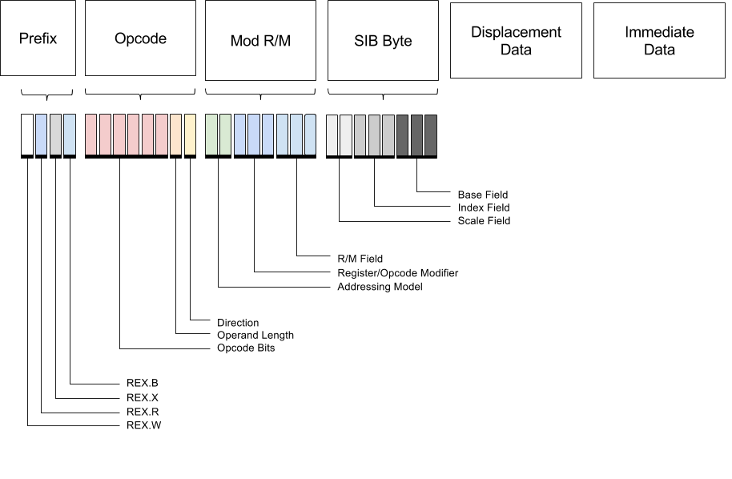
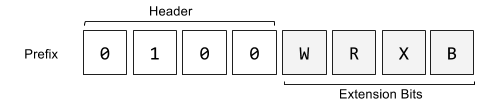

> Monad是一种Context Sensitive的CodeGen -- 笔者言

这话该是何时说的？应该有几个月了(当前时间: 2022.2.7)，当时是在讨论IO Monad为什么是纯的，笔者好说怪话，于是抛出了一篇暴论博客**C is purely functional language**,进而迫真论证图灵机也是纯函数式，顺便还说了上面那番话。

之后有群友发给我一篇博客:

https://www.stephendiehl.com/posts/monads_machine_code.html

好吧，其实只是群友顺手分享，不是他发给我一个人看的。这唤醒了我冻结的记忆，赶忙翻出收藏中的俩篇博客

http://www.wall.org/~lewis/2013/10/03/inverting.html

http://wall.org/~lewis/2013/10/15/asm-monad.html

因为笔者是野路子出身......算了不编了，因为这俩篇博客涉及汇编，所以收藏了一直没看。

顺便，在动手写下这份笔记的时候，还看到有人在F#上实现了一个类似的EDSL，毕竟F#也是有计算表达式的嘛。

概述一下思路:

这是一行x86汇编(默认Intel语法, 目标操作数在前面)

```assembly
; xor一般叫操作项，eax和esi一般叫操作数
xor eax, esi
```

但是既然我们打算在haskell里把它实现成一个EDSL，那它就应该是个普普通通的值。

大概有人会想到，用ADT描述一个x86指令的子集

```haskell
data Val
  = I Int64      -- Integer
  | R Reg        -- Register
  | A Word32     -- Addr
  deriving (Eq, Show)

data Instr
  = Ret
  | Mov Val Val
  | Add Val Val
  | Sub Val Val
  | Mul Val
  | IMul Val Val
  | Xor Val Val
  | Inc Val
  | Dec Val
  | Push Val
  | Pop Val
  | Call Val
  | Loop Val
  | Nop
  | Syscall
  deriving (Eq, Show)
```

那么下一步呢？大概是直球编译吧。一段机器码刨除其内蕴的结构和开发者所表达的想法，那不过就是一段字节流，用`[Word8]`就能表示。

```haskell
assembler :: [Instr] -> [Word8]
-- Data.Word模块
-- Word8用于表示单个字节，不过仍然是个包装过的ADT
```

这有点像什么？haskell的早期流式IO！但是比起真正的汇编这其实还有所不如了 -- 没label, 很难复用。所以我们需要monad。

准确来说，此处需要的是一个State Monad的变体

```haskell
type X86 a = StateT JITMem (Except String) a
```

状态类型JITMem是个不算简单的Record，它包含这些信息：

+ “源码”(在这里是直接记录上面的指令集类型了，毕竟EDSL也没有parse步骤)
+ 对应的机器码
+ 指令计数
+ 指令在内存中的起始地址，这个是逻辑上不应该改变的常量。
+ 当前指令的内存偏移量
  
> 比较生草的是Stephen的初始化函数里面已经把偏移量的初值设成起始地址了，但是后面的代码里他还总是`gets _memptr`，然后拿出来又不用......

```haskell
data JITMem = JITMem
 { _instrs :: [Instr]
 , _mach   :: [Word8]
 , _icount :: Word32
 , _memptr :: Word32
 , _memoff :: Word32
 } deriving (Eq, Show)
```

有些人已经可以想象到做法了，但是我还是去抄了下作业才明白：这是个简单的jit，通过State Monad编写机器指令生成器，给定一个初始地址之后生成机器码，然后放进内存(利用GHC的FFI)执行。

框架已经明晰，但是痛苦的体力活和一些细节逃不开。

同时我也吐槽一下，第一次学x86汇编，感觉真的非常繁杂啊，怪不得大伙总是提RISC—V。

## Types

x86-64指令集起初为intel的8086CPU家族设计，主要的数据类型包括整数和浮点数，虽然一一列举它们很乏味，但是没法躲开。

整型：4种变体

```
Byte           | 00 |

Word           | 00 | 00 |  

DoubleWord     | 00 | 00 | 00 | 00 |

QuadWord       | 00 | 00 | 00 | 00 | 00 | 00 | 00 | 00 |
```

大小区别一目了然，不过还有一事，即intel架构普遍采用小端字节序，这也是知名计算机模因了，仅举一例说明：

16进制数`0xC0FFEE`作为DWORD表示，内存布局如下

```
         |-- 高位--|-- 低位 --|
         +-------------------+
0xC0FFEE | EE | FF | C0 | 00 |
```

汇编语言中的指针只是个地址空间中的地址 -- 用一个整型表示，原文作者Stephen表示他用Linux，示例代码只考虑Linux x86-64环境,但是把mmap和mprotect的FFI调用换一换也能拿到别的平台跑。

> 在与C库交互时作者使用了在Unix平台上通行的System V调用约定，所以Windows版大概要费些功夫。

对于汇编操作数，大概不是数据便是寄存器或者地址 -- 别叫指针了，毕竟不是C. 那么简简单单写个ADT来表示

```haskell
data Val
  = I Int64      -- 64位整数，有符号
  | R Reg        -- 寄存器，Reg类型就是个枚举
  | A Word32     -- 地址
  deriving (Eq, Show)
```

下一步，了解寄存器。

## Register

1946年，亚瑟，赫尔曼和约翰冯诺依曼在普林斯顿聚首，为他们所谓的“电子记忆器官”起草了一个设计方案。他们的想法之一基于现实世界的限制：无限量的快速存储能力做不到，那就弄个分级存储器体系，每一级的存储空间胜过上一级，代价是读取速度变慢。常用的数据自然应该放在能快速拿到手的地方，对吧。

对于程序员而言，会在编程中接触到的最小存储器大概就是它了：寄存器。我第一次认真地尝试了解它是在那本著名的科普书**编码：隐匿在计算机软硬件背后的语言**上，但是认识层次始终停留于“它是个存储器”。

x86架构下有16个通用64位寄存器，放quadword完全够。其中声名在外的有：`rax, rbx, rcx, rdx, rbp, rsi, rdi, rsp`

```haskell
data Reg
  = RAX  -- 累积器
  | RCX  -- 计数器 (循环计数器)
  | RDX  -- 数据
  | RBX  -- 基础，通用
  | RSP  -- 当前栈指针
  | RBP  -- Previous Stack Frame Link
  | RSI  -- Source Index Pointer
  | RDI  -- Destination Index Pointer
  deriving (Eq, Show)
```

它们有编制的，不只是名字，还有数字对应。

```
RAX RBX RCX	RDX	RBP	RSI	RDI	RSP
 0	 1	 2	 3	 4	 5	 6	 7
```

这编号会用于一些特殊的寄存器操作指令(二进制表示中会用到)。

```haskell
index :: Reg -> Word8
index x = case x of
  RAX -> 0
  RCX -> 1
  RDX -> 2
  RBX -> 3
  RSP -> 4
  RBP -> 5
  RSI -> 6
  RDI -> 7

-- 偏函数注意
```

其实x86还允许把这些64位寄存器当成更小的寄存器使用(名称上大概就是从rax到eax再到ax), 不过还是让我们暂时不去管这些个繁文缛节，先看看x86的指令操作数(operands)与操作码(opcode)吧。

## Instructions

首先给出一个指令的ADT表示

```haskell
data Instr
  = Ret
  | Mov Val Val
  | Add Val Val
  | Sub Val Val
  | Mul Val
  | IMul Val Val
  | Xor Val Val
  | Inc Val
  | Dec Val
  | Push Val
  | Pop Val
  | Call Val
  | Loop Val
  | Nop
  | Syscall
  deriving (Eq, Show)
```

将一个指令追加到JIT Memory中，可以看作将指令对应的字节串追加到整个机器码程序尾部，为了让后面的程序可以使用label，还要更新一下偏移量，载入内存并执行是平台相关的内容，下面详述。

```haskell
emit :: [Word8] -> X86 ()
emit i = modify $ \s -> s
  { _mach   = _mach s ++ i
  , _memoff = _memoff s + fromIntegral (length i)
  }
```

### Opcodes & Operands

应该不会太让人意外的是，汇编里的某个抽象指令(如mov)有可能对应多个操作码：

+ 将数据从一个寄存器移到另一个寄存器 - 0x89
+ 将立即数存至某个寄存器 - 0xC7

当然了根据前文我们知道，x86-64有好几种大小的寄存器，那么怎么在指令中标注其所使用的寄存器/立即数/内存宽度呢？这项工作在x86-64上靠指令的前缀部分实现，但这要在后面介绍指令结构时才会详细叙述。

为了让读者能读懂[intel官方的手册](https://www-ssl.intel.com/content/dam/www/public/us/en/documents/manuals/64-ia-32-architectures-software-developer-instruction-set-reference-manual-325383.pdf), 必须介绍一下前缀+操作数这种记法。

| 前缀 | 描述 |
|:---|:---|
| r<size> | 寄存器操作数 |
| imm<size> | 立即数 |
| m<size> | 内存操作数 |

例子:

+ r64表示一个64位寄存器
+ imm8表示一个8位立即数
+ m32表示一块32位的内存

如果存在好几种操作数都对应同一操作码，那么用斜线隔开(如`r8/r16/r32`).

Stephen Diehl选择的指令集子集里面包含一字节和二字节大小的操作码

```
Instruction 	Opcode
CALL 	    E8
RET 	    C3
NOP 	    0D
MOV 	    89
PUSH 	    50
POP 	    58
LOOP 	    E2
ADD 	    83
SUB 	    29
MUL 	    F7
DIV 	    F7
INC 	    FF
DEC 	    FF
NEG 	    F7
CMP 	    39
AND 	    21
OR 	        09
XOR 	    31
NOT 	    F7
ADC 	    11
IDIV 	    F7
IMUL 	    F7
XCHG 	    87
BSWAP       C8
SHR 	    C1
SHL 	    C1
ROR 	    C0
RCR 	    C0
BT 	        BA
BTS 	    BA
BTR 	    B3
JMP 	    EB
JE 	        84
JNE 	    85
SYSCALL 	05
```

### Machine Code

x86-64的指令结构复杂，历史遗留繁冗，以至于有人出了一篇论文*Enumerating x86-64 - It's Not as Easy as Counting*, 如果这还可以看作论文作者的一家之言，再看看325383这本手册的厚度吧，2198页，已经超过很多高级语言的Spec厚度了。



各部分的具体大小取决于操作码

| Prefix | Opcode | Mod R/M | Scale Index Base | Displacement | Immediate
| :---: | :---: | :---: | :---: | :---: | :---: |
| 1-4 bytes | 1-3 bytes | 1 Byte | 1 Byte | 1-4 Bytes | 1-4 Bytes |

以下的结构将只适用于上面所提到的子集。

#### Prefix



前四位固定常数 0b0100, 后四位控制扩展开关。W修改操作宽度，R X B扩展寄存器编码方式


+ REX.W – Extends the operation width
+ REX.R – Extends ModRM.reg
+ REX.X – Extends SIB.index
+ REX.B – Extends SIB.base or ModRM.r/m


#### ModR/M byte/寻址模式字节


指令的这一部分既负责配置操作数，又要标记寻址模式。细节太多，不一一列举。

#### Scale Index Base


操作数地址通过**base + scale * index**获取

## 预定义的一些"指令"

总不能全部手动拼字节串吧，比拼字符串还邪恶

```haskell

ret :: X86 ()
ret = do
  emit [0xc3]

-- add <r64> <imm32>
-- 0:  48 83 c0 01             add    rax,0x1
add (R l) (I r) = do
  emit [0x48]              -- REX.W prefix
  emit [0x05]              -- ADD
  imm r
-- add <r64> <r64>
-- 0:  48 01 e0                add    rax,rsp
add (R l) (R r) = do
  emit [0x48]              -- REX prefix
  emit [0x01]              -- ADD
  emit [0xc0 .|. opcode r `shiftL` 3 .|. opcode l]
```

脏活干完了最后就可以写这样的程序

```haskell
arith :: X86 ()
arith = do
  mov rax (I 18)
  add rax (I 4)
  sub rax (I 2)
  imul rax (I 2)
  ret
```

## 代码载入

生成二进制代码后，还需要有办法将其放进内存。Stephen Diehl选择用linux下的mmap系统调用，它需要一些特定的常量作为参数来控制所申请的内存需要哪些性质。

首先看一眼GLibc的源码: https://sourceware.org/git/?p=glibc.git;a=blob;f=bits/mman.h;h=1d9f6f8d9caba842983f98ff2f2dd5a776df054c;hb=HEAD#l32

```c
#define PROT_NONE       0x00    /* 不可访问  */
#define PROT_READ       0x04    /* 可读 */
#define PROT_WRITE      0x02    /* 可写 */
#define PROT_EXEC       0x01    /* 可执行 */

#define MAP_FILE        0x0001  /* mapped from a file or device */
#define MAP_ANON        0x0002  /* 作者写的注释是: 从内存或交换空间中分配, glibc代码里面的注释则是: 从匿名虚拟内存中分配 */
#define MAP_TYPE        0x000f  /* mask for type field */
```

> 一开始有点疑惑MAP_ANON在代码里的值是0x20, 看了下作者放在github的代码库也是,,, 而且mapPrivate在mman.h里面是0x0000，后来找了份[比较新的源码](https://codebrowser.dev/glibc/glibc/sysdeps/unix/sysv/linux/bits/mman-linux.h.html)看，代码里的没错，想来这玩意具体常数大概会进行更换。解析头文件的工程量太大了，不太现实，连swift都调用clang来解决这个问题。这是真的，C Isn't A Programming Language Anymore这篇博客的作者在推特上抱怨关于abi的一些问题，Doug Gregor当即在回复中和盘托出: "All of this is the reason that Swift uses Clang internally to handle the (C)++ ABI. That way, we’re not chasing every new ABI-impacting attribute Clang adds"
>
> 如果你和我一样不知道为什么parse下头文件还跟C ABI能扯上关系，请看: https://faultlore.com/blah/c-isnt-a-language/

```haskell
newtype MmapOption = MmapOption CInt
  deriving (Eq, Show, Ord, Num, Bits)

protExec    = ProtOption 0x01
protWrite   = ProtOption 0x02
mmapAnon    = MmapOption 0x20
mmapPrivate = MmapOption 0x02

mapAnon = 0x20
mapPrivate = 0x02

allocateMemory :: CSize -> IO (Ptr Word8)
allocateMemory size = mmap nullPtr size pflags mflags (-1) 0
  where
    pflags = protRead <> protWrite
    mflags = mapAnon .|. mapPrivate
```

把haskell的字符串传递给JIT发射的代码需要做做转换

```haskell
heapPtr :: Ptr a -> Word32
heapPtr = fromIntegral . ptrToIntPtr

asciz :: [Char] -> IO Word32
asciz str = do
  ptr <- newCString (str ++ ['\n']) -- 非常C语言的
  return $ heapPtr ptr
```

由于现在C成为了某种与操作系统交互的事实标准，不可避免地需要借用一些C函数，这可以通过动态链接器做到。GHC的haskell运行时使用了glibc的stdio.h和math.h，这两个头文件中的符号都可以通过此方式找到对应运行时地址。

```haskell
extern :: String -> IO Word32
extern name = do
  dl <- dlopen "" [RTLD_LAZY, RTLD_GLOBAL]
  fn <- dlsym dl name
  return $ heapPtr $ castFunPtrToPtr fn
```

准备工作做好之后就可以进行代码加载和执行了

```haskell
jit :: Ptr Word8 -> [Word8] -> IO (IO Int)
jit mem machCode = do
  code <- codePtr machCode
  withForeignPtr (vecPtr code) $ \ptr -> do
    copyBytes mem ptr (8*6)
  return (getFunction mem)

foreign import ccall "dynamic"
  mkFun :: FunPtr (IO Int) -> IO Int

getFunction :: Ptr Word8 -> IO Int
getFunction mem = do
  let fptr = unsafeCoerce mem :: FunPtr (IO Int)
  mkFun fptr
```

略去一些实现细节，最后可以写这样的程序:

```haskell
main :: IO ()
main = do
  mem <- allocateMemory jitsize                -- create jit memory
  let Right st = assemble mem arith            -- assemble symbolic program
  fn  <- jit mem (_mach st)                    -- jit compile
  res <- fn                                    -- call function
  putStrLn $ "Result: " <> show res
```

## 跳转和循环

跳转很简单，haskell对state monad提供了gets函数获取状态中某一部分需要的信息

```haskell
label :: X86 Val
label = do
  addr <- gets _memoff
  ptr  <- gets _memptr
  return (A addr)
```

loop指令的操作数是循环体起止代码地址的差值

```haskell
loop :: Val -> X86()
loop (A dst) = do
  emit [0xE2]
  src <- gets _memoff
  ptr <- gets _memptr
  emit [fromIntegral $ dst - src]
```

## 调用约定

要调C库的函数，不得不遵守调用约定，Linux-x64的调用约定用System-V即可。

## 尾声

我有点理解为什么qemu要用gcc炒回锅肉了。